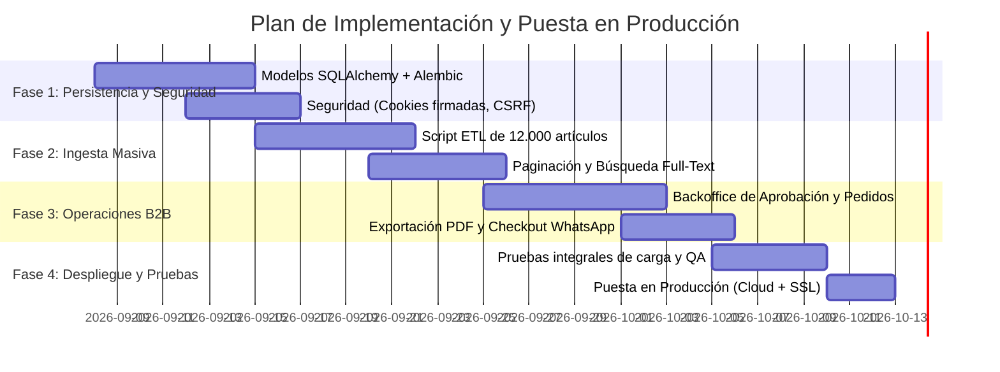

# INFORME TÉCNICO Y PLAN ESTRATÉGICO DE MEJORAS: ATUEL GOMAS
**Rol:** Analista de Sistemas Senior / Jefe de Proyecto  
**Destinatario:** Equipo Directivo y de Desarrollo  
**Fecha:** Septiembre 2026  
**Versión del Documento:** 1.0  

---

## 1. Resumen Ejecutivo y Diagnóstico Inicial

El proyecto **Atuel Gomas** presenta una base arquitectónica inicial de **alta calidad**, algo poco común en etapas tempranas de desarrollo comercial. La adopción de **Clean Architecture**, **Domain-Driven Design (DDD) táctico** y la combinación tecnológica de **FastAPI + Jinja2 + HTMX** sitúan al sistema en un camino de bajo acoplamiento, excelente rendimiento y nulo coste inicial de licencias.

Sin embargo, para dar el salto desde un **prototipo funcional en memoria** hacia una **plataforma comercial de nivel bancario/industrial**, es indispensable abordar vulnerabilidades de seguridad, persistencia real de datos, optimización para grandes volúmenes de catálogo (+12.000 artículos) y gestión operativa del negocio B2B.

---

## 2. Auditoría Técnica: Diagnóstico Detallado

### 2.1. Fortalezas Actuales (Lo que está bien)
1. **Separación de Responsabilidades e Inversión de Dependencias (IoC):**
   - El núcleo de dominio (`Product`, `Customer`, `Order`) y los casos de uso están completamente desacoplados de frameworks web y bases de datos.
   - El contenedor central de dependencias (`src/infrastructure/config/container.py`) permite intercambiar adaptadores sin tocar lógica de negocio.
2. **Uso de Objetos de Valor (Value Objects):**
   - Entidades como `CUIT`, `Money` y `Dimensions` encapsulan validaciones y reglas de negocio, previniendo el antipatrón de *Primitive Obsession*.
3. **Stack Tecnológico Pragmático (SSR con Jinja2 + HTMX):**
   - Evita la sobreingeniería de un frontend desacoplado (React/Vue), garantizando indexación SEO instantánea de piezas técnicas automotrices, tiempos de carga mínimos y reactividad fluida en búsquedas.
4. **Normalización de Datos en `datos provicionales/`:**
   - La atomización de 27 hojas del catálogo a formato 3FN (Tercera Forma Normal) con extracción de 12.461 artículos e imágenes es un activo crítico ya resuelto.

---

### 2.2. Hallazgos Críticos y Vulnerabilidades (Lo que está mal)

#### 🔴 Crítico 1: Sesiones Basadas en Cookies en Texto Plano (Riesgo IDOR / Hijacking)
- **Diagnóstico:** En `web_controller.py`, la autenticación se gestiona leyendo directamente el identificador en la cookie `b2b_session_user_id` sin firma criptográfica ni expiración verificada por servidor.
- **Impacto:** Un usuario puede cambiar manualmente el valor de la cookie en las herramientas de desarrollador y usurpar la cuenta de otra ferretería o cliente mayorista (*Insecure Direct Object Reference*).
- **Acción requerida:** Implementar cookies de sesión firmadas con clave secreta (usando `itsdangerous` o tokens JWT cifrados con `HS256`/`RS256` y atributos `HttpOnly`, `Secure`, `SameSite=Lax`).

#### 🔴 Crítico 2: Falta de Protección CSRF (Cross-Site Request Forgery)
- **Diagnóstico:** Los formularios POST (`/login`, `/registro` y órdenes de compra) no implementan tokens anti-falsificación.
- **Impacto:** Posibilidad de que sitios maliciosos fuercen transacciones en nombre de una sesión abierta de un cliente.
- **Acción requerida:** Incorporar middleware de validación CSRF para FastAPI/Jinja2 (ej. `starlette-csrf` o tokens sincrónicos por sesión).

#### 🔴 Crítico 3: Persistencia Volátil en Memoria
- **Diagnóstico:** Toda la información vive actualmente en `MemoryProductRepository` y `MemoryCustomerRepository`.
- **Impacto:** Cualquier reinicio de la instancia en Render/Railway borra cuentas de clientes, pedidos y modificaciones.
- **Acción requerida:** Migrar a PostgreSQL administrado (ej. Neon.tech / Supabase / Render Postgres) con SQLAlchemy 2.0 y Alembic para versionado del esquema.

#### 🔴 Crítico 4: Ausencia de Paginación y Riesgo de Saturación de Memoria
- **Diagnóstico:** El endpoint `/api/productos/search` retorna todos los registros coincidentes sin límite (`LIMIT` / `OFFSET`).
- **Impacto:** Al cargar los 12.461 registros de la empresa, una búsqueda vacía o amplia colapsará la memoria del servidor y el renderizado HTML de Jinja2.
- **Acción requerida:** Implementar paginación reactiva por scroll infinito o botones mediante atributos HTMX (`hx-trigger="revealed"`, `page`, `page_size`).

#### 🟡 Medio 1: Manejo Financiero en Punto Flotante
- **Diagnóstico:** El uso de tipos primitivos numéricos en importes puede generar imprecisiones por redondeo IEEE 754.
- **Acción requerida:** Obligatoriedad de tipo `Decimal` en `Money` y en el mapeo ORM con precisión contable de 2 a 4 decimales para cálculos de IVA, percepciones y recargos.

#### 🟡 Medio 2: Flujo de Aprobación B2B Trunco
- **Diagnóstico:** La propiedad `Customer.is_approved` existe en el modelo de dominio pero no existe interfaz para que un administrador o vendedor apruebe a las ferreterías que solicitan cuenta de gremio.
- **Acción requerida:** Crear el módulo de administración (`Backoffice`) con roles y permisos (`UserRole.ADMIN`, `UserRole.SALES_AGENT`).

---

## 3. Plan Detallado de Mejoras a Implementar

### Módulo A: Seguridad, Autenticación y Autorización
- [ ] **Firmado Criptográfico de Cookies:** Migrar a sesión encriptada/firmada con rotación de claves (`SECRET_KEY`).
- [ ] **Protección Anti-CSRF:** Incorporación de tokens dinámicos en todas las plantillas Jinja2 con formularios POST.
- [ ] **Rate Limiting (Protección contra Ataques de Fuerza Bruta):** Implementar limitador de intentos en `/login` y `/registro` con `slowapi`.
- [ ] **Políticas de Cabeceras HTTP:** Configurar cabeceras de seguridad OWASP (HSTS, Content-Security-Policy, X-Frame-Options, X-Content-Type-Options).

### Módulo B: Capa de Persistencia y Modelado de Base de Datos
- [ ] **Modelos Relacionales en SQLAlchemy 2.0:**
  - Tabla `productos` y `categorias`.
  - Tablas de atributos: `talles_medidas`, `materiales`, `colores`, `punteras_seguridad`.
  - Tablas intermedias de compatibilidad vehicular: `marca`, `modelo`, `motorizacion`, `anio_desde`, `anio_hasta`.
  - Tablas de clientes (`clientes`), pedidos (`ordenes`) y detalle de pedidos (`items_orden`).
- [ ] **Migraciones con Alembic:** Configurar entorno de migraciones versionadas para despliegues sin interrupciones.
- [ ] **Implementación de Repositorios SQL:**
  - Desarrollar `SqlAlchemyProductRepository`, `SqlAlchemyCustomerRepository` y `SqlAlchemyOrderRepository`.
  - Enchufar los repositorios concretos en `container.py` manteniendo los Use Cases intactos.

### Módulo C: Ingesta y Sincronización Masiva de Datos (ETL)
- [ ] **Script Seeder / Importador Automático:**
  - Crear un proceso de carga batch (`scripts/seed_database.py`) que procese las 27 carpetas de `datos provicionales/` e inserte jerárquicamente las categorías, artículos y atributos.
- [ ] **Módulo de Actualización Masiva por Excel/CSV:**
  - Panel restringido para que el personal comercial de Atuel Gomas pueda subir una lista de precios actualizada en Excel y actualizar los precios mayoristas y de lista sin intervención técnica.

### Módulo D: Rendimiento, Búsqueda y Experiencia de Usuario (UX)
- [ ] **Paginación Dinámica con HTMX:** Carga fraccionada de 20 a 30 productos con reemplazo suave en el DOM.
- [ ] **Búsqueda Avanzada / Fuzzy Search:**
  - Utilizar capacidades de PostgreSQL Full-Text Search (`tsvector`) o extensión `pg_trgm` para tolerar faltas ortográficas y buscar tanto por código SKU, marca, modelo vehicular o medidas milimétricas.
- [ ] **Caché de Segundo Nivel:** Implementar Redis o caché en memoria local (LRU cache) para categorías y consultas de alta demanda.
- [ ] **Optimización y CDN de Imágenes:** Servir imágenes técnicas en formatos modernos (`WebP`) redimensionadas dinámicamente.

### Módulo E: Operaciones Comerciales y Funcionalidades B2B
- [ ] **Panel de Administración (Backoffice):**
  - Bandeja de entrada de solicitudes de registro B2B pendientes de aprobación.
  - Gestión de clientes, asignación de listas de precios especiales o descuentos porcentuales por gremio.
  - Monitor de pedidos entrantes con cambio de estados (`Pendiente`, `En Preparación`, `Facturado`, `Despachado`).
- [ ] **Generador de Presupuestos en PDF:** Exportación formal descargable del pedido/carrito con membrete de Atuel Gomas para talleres.
- [ ] **Integración Comercial por WhatsApp:** Generación automática de enlace `wa.me` con el pedido formateado en texto para confirmación inmediata con el vendedor asignado.

---

## 4. Equipo y Roles Recomendados para Ejecución Profesional

Para garantizar un producto robusto, seguro y entregado en tiempo y forma, se definen dos esquemas de trabajo:

### Opción 1: Célula Ágil / Lean (Recomendada para PYME / Lanzamiento Rápido)
Equipo compacto de 3 personas de alta productividad:

| Rol | Dedicación | Responsabilidades Principales |
| :--- | :--- | :--- |
| **Tech Lead / Senior Backend (Python)** | Full-Time | Arquitectura, modelado relacional en PostgreSQL, seguridad OWASP, optimización de queries, CI/CD y despliegue continuo. |
| **Fullstack / Frontend (HTMX/CSS/Jinja)** | Full-Time | Experiencia de usuario, componentes HTMX, diseño responsivo para móviles/talleres, panel administrativo backoffice. |
| **Analista Funcional / Data Specialist** | Part-Time (Hitos) | Saneamiento de datos, validación de compatibilidades vehiculares con el cliente comercial, pruebas de homologación de precios. |

### Opción 2: Estructura Formal de Proyecto Corporativo
Si se requiere integración formal con sistemas de gestión legados (Tango, Bejerman, SAP):
1. **Jefe de Proyecto / Scrum Master (PM):** Gestión del alcance, presupuesto, cronograma e interlocución directa con la dirección de Atuel Gomas.
2. **Arquitecto de Software / Backend Senior:** APIs, persistencia, transaccionalidad bancaria y seguridad.
3. **Ingeniero de Datos / DBA:** Optimización de índices, particionamiento de catálogo y sincronizadores ETL.
4. **Diseñador UX / Frontend Engineer:** Interfaces de usuario, catálogo técnico y accesibilidad.
5. **Especialista QA & Automatización:** Pruebas funcionales de punta a punta, pruebas de estrés y verificación de cálculos fiscales.

---

## 5. Cronograma Sugerido de Fases (Roadmap a 6 Semanas)

---
*Documento elaborado y archivado en `documentacion/MEJORAS_Y_PLAN_PROFESIONAL.md` para seguimiento técnico y gobernanza del proyecto.*
