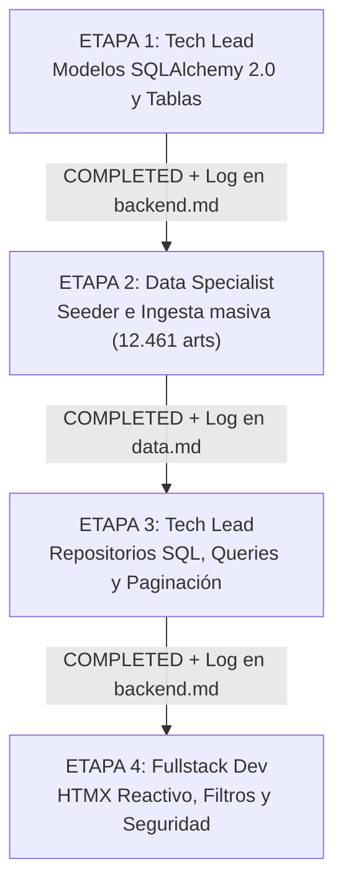

# PLAN DE TRABAJO SECUENCIAL POR ETAPAS (RELEVOS 1 A 1)
**Proyecto:** Atuel Gomas - Plataforma Web B2B y Catálogo Técnico  
**Metodología:** Desarrollo por Postas Secuenciales (Un solo agente activo por turno)

---

## 🧭 ¿Cómo funciona esta modalidad?
Dado que opera un único agente a la vez, el sistema funciona como una **carrera de relevos**:
1. El usuario invoca al agente de la etapa correspondiente indicándole su rol.
2. El agente lee `.team/board.json` y el changelog del agente anterior.
3. El agente ejecuta **únicamente su tarea asignada**.
4. Al terminar, el agente **se detiene obligatoriamente**:
   - Actualiza `.team/board.json` cambiando su etapa a `"COMPLETED"` y habilitando la siguiente etapa.
   - Escribe en su changelog (`.team/changelog/{rol}.md`) el detalle técnico exacto de lo que hizo y las instrucciones para el siguiente agente.
   - Informa al usuario: *"Etapa [X] concluida. El sistema queda listo para invocar a [Siguiente Agente]"*.

---

## 📋 Matriz de Etapas, Tareas y Criterios de Parada

---

### 🔹 ETAPA 1: Tech Lead (Modelado Relacional y Motor de Base de Datos)
- **Rol Activo:** Tech Lead / Backend Architect.
- **Objetivo:** Dejar creada la estructura de base de datos en SQLAlchemy 2.0 (PostgreSQL/SQLite) con soporte para variantes, compatibilidad vehicular y categorías.
- **Tareas Concretas:**
  1. Crear `src/infrastructure/database/connection.py` (motor, sesiones async o sync, Base declarativa).
  2. Crear los modelos ORM en `src/infrastructure/database/models/`:
     - `CategoriaModel` y `FamiliaModel`
     - `ProductoModel` (con campos de precios, código, stock)
     - `VarianteModel`, `TalleModel`, `ColorModel`, `MaterialModel`, `PunteraModel`
     - `CompatibilidadVehicularModel` (marca, modelo, motorización, años)
     - `ClienteModel` y `OrdenModel`
  3. Crear script o función de inicialización que cree las tablas físicas (`Base.metadata.create_all`).
- **🛑 Cuándo Detenerse y Criterio de Entrega:**
  - En cuanto las tablas se puedan crear sin errores de importación o sintaxis.
  - **Acción final:**
    - Cambiar `etapa_1_modelos_y_tablas` a `"COMPLETED"` y `etapa_2_ingesta_y_datos` a `"READY"` en `.team/board.json`.
    - Documentar en `.team/changelog/backend.md`: nombres exactos de clases ORM, nombres de tablas, llaves foráneas y tipos de datos.

---

### 🔹 ETAPA 2: Data Specialist (ETL, Seeder y Carga de Catálogo Real)
- **Rol Activo:** Data Specialist / Ingeniero de Datos.
- **Objetivo:** Leer los datos estructurados en `datos provicionales/` y llenar la base de datos real con los 12.461 registros e imágenes.
- **Paso 0 Obligatorio:** Leer `.team/changelog/backend.md` para importar los modelos ORM creados en la Etapa 1.
- **Tareas Concretas:**
  1. Crear el script `scripts/seed_database.py`.
  2. Implementar la lectura ordenada de las 27 carpetas de `datos provicionales/`:
     - Inserción de Categorías y Familias.
     - Inserción de Productos base y sus Variantes (talles, materiales, colores).
     - Inserción de Compatibilidades vehiculares donde aplique.
  3. Ejecutar el script y validar que se insertaron los registros correctamente sin duplicar SKUs.
- **🛑 Cuándo Detenerse y Criterio de Entrega:**
  - Cuando el seeder corra con éxito y la base de datos contenga los datos reales persistidos.
  - **Acción final:**
    - Cambiar `etapa_2_ingesta_y_datos` a `"COMPLETED"` y `etapa_3_repos_y_queries` a `"READY"` en `.team/board.json`.
    - Documentar en `.team/changelog/data.md`: total de artículos insertados, total de categorías, advertencias sobre registros omitidos si hubo alguno.

---

### 🔹 ETAPA 3: Tech Lead (Repositorios SQL, Consultas y Paginación)
- **Rol Activo:** Tech Lead / Backend Architect.
- **Objetivo:** Conectar el núcleo de la aplicación a la base de datos real y reemplazar los repositorios en memoria.
- **Paso 0 Obligatorio:** Leer `.team/changelog/data.md` para verificar que la DB ya tiene volumen de datos real para probar las consultas.
- **Tareas Concretas:**
  1. Implementar `src/adapters/repositories/sql_product_repository.py` implementando la interfaz `IProductRepository`:
     - Consulta por búsqueda de texto (`query`), categoría y compatibilidad vehicular.
     - Implementar paginación (`limit`, `offset` o cursor) obligatoria para manejar los 12.000 artículos.
  2. Implementar `SqlCustomerRepository` y `SqlOrderRepository` si corresponde.
  3. Modificar `src/infrastructure/config/container.py` para inyectar los repositorios SQL en lugar de los `Memory...`.
  4. Ejecutar la suite de tests (`pytest`) y verificar que los casos de uso siguen respondiendo idéntico pero contra datos persistentes.
- **🛑 Cuándo Detenerse y Criterio de Entrega:**
  - Cuando los tests pasen y las queries devuelvan los productos reales paginados.
  - **Acción final:**
    - Cambiar `etapa_3_repos_y_queries` a `"COMPLETED"` y `etapa_4_frontend_y_seguridad` a `"READY"` en `.team/board.json`.
    - Documentar en `.team/changelog/backend.md`: nuevos métodos disponibles en repositorios, parámetros de paginación y ejemplos de uso.

---

### 🔹 ETAPA 4: Fullstack Dev (UI Reactiva HTMX, Filtros y Seguridad)
- **Rol Activo:** Fullstack Developer (Jinja2 + HTMX).
- **Objetivo:** Adecuar las pantallas para navegar el catálogo de 12.000 productos con fluidez y asegurar el sitio.
- **Paso 0 Obligatorio:** Leer `.team/changelog/backend.md` para conocer los parámetros de paginación y filtros que recibe el backend.
- **Tareas Concretas:**
  1. Actualizar `src/adapters/controllers/web_controller.py`:
     - Incorporar parámetros de paginación (`page`, `page_size`) en `/api/productos/search` y `/`.
     - Implementar firma segura de cookies de sesión para evitar spoofing.
  2. Actualizar las vistas Jinja2:
     - `src/infrastructure/templates/partials/product_grid.html`: soporte para scroll infinito o botones de paginación con HTMX (`hx-get`, `hx-swap="beforeend"`).
     - Incorporar selectores dinámicos de Marca, Modelo y Categoría con filtros HTMX instantáneos.
  3. Verificar en navegador la fluidez de carga y respuesta visual.
- **🛑 Cuándo Detenerse y Criterio de Entrega:**
  - Cuando el catálogo se navegue de forma reactiva y rápida.
  - **Acción final:**
    - Cambiar `etapa_4_frontend_y_seguridad` a `"COMPLETED"` en `.team/board.json`.
    - Documentar en `.team/changelog/frontend.md`: pantallas actualizadas, endpoints HTMX ajustados y resultado visual.

---

## 🗣️ Guía Rápida para el Usuario: Cómo dar las órdenes en el chat

Para invocar a cada agente en su turno, simplemente usá estos comandos:

1. **Para arrancar Etapa 1:**
   > *"Actúa como el Tech Lead para la Etapa 1. Revisa .team/board.json y la documentación en documentacion/PLAN_DE_ETAPAS_SECUENCIALES.md. Construye los modelos SQLAlchemy 2.0 y la conexión de base de datos. Al terminar, actualiza el board y tu changelog."*

2. **Para arrancar Etapa 2 (una vez terminada la 1):**
   > *"Actúa como el Data Specialist para la Etapa 2. Revisa el changelog de Tech Lead, toma los modelos creados y escribe/ejecuta el script Seeder con los datos de datos provicionales/. Al terminar, actualiza el board y tu changelog."*

3. **Para arrancar Etapa 3 (una vez terminada la 2):**
   > *"Actúa como el Tech Lead para la Etapa 3. Implementa los repositorios SQLAlchemy con paginación, conéctalos en container.py y verifica los tests. Al terminar, actualiza el board y tu changelog."*

4. **Para arrancar Etapa 4 (una vez terminada la 3):**
   > *"Actúa como el Fullstack Dev para la Etapa 4. Ajusta web_controller.py y las plantillas HTMX para soportar la paginación y filtros con el catálogo real. Al terminar, actualiza el board y tu changelog."*
